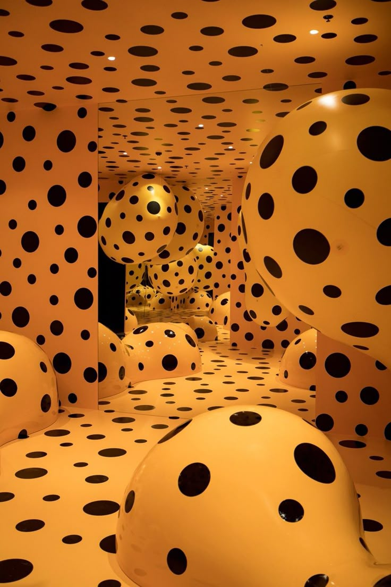

# Generative Perlin Wheel: "Shimmering Life Layers" 
This project is a generative art work implemented using p5.js, inspired by Pacita Abad's Wheels of Fortune and Yayoi Kusama's Polka Dot Art. The work drives multiple visual elements through Perlin noise, making them flow, breathe, and glow in the picture, creating a dynamic picture with a sense of meditation, rhythm, and depth.

---

## Interaction Instructions
There are **no required interactions** — just open the page and let the animation evolve:
1. Open project in **Visual Studio Code**  
2. Right-click `index.html` → **Open with Live Server**  
3. Animation auto-plays upon loading  
4. Observe organic evolution: forms continuously generate, grow, and fade  
5. Support for browser window size changes, visual elements are automatically scaled to fit the screen.

---

## Design Concept and Visual Inspiration

- **Pacita Abad's 'Wheels of fortune'** 
Her work uses concentric circles and layered visual structures to express the flow of destiny, which inspired me to add rotating wheels of light and circular breathing elements to the visual structures.
_Figure 1_

- **Yayoi Kusama’s dotted patterns**
Her polka dot pattern inspired me to add a lot of **ring dots and particles** to reflect the repetitive and cyclical nature of life. Supporting browser window size changes, the visual elements automatically scale to fit the screen.
_Figure 2_

The four types of visual elements in the work each symbolise different metaphors of life:

- **NoiseBlob**: a floating, breathing mass of light like fog, representing the flow of time and life.
- **Radiant**: radiating, rotating light, symbolising energy, awakening or significant moments.
- **Hole**: a black void, symbolising the absence of memory and emotional gaps.
- **Spark**: a flickering particle representing a fleeting memory or experience.

---

## Technical Description

The motion of all elements is controlled by **Perlin noise** and **Sinusoidal function**, simulating the **randomness** and coherence found in the natural world.

To achieve the ability to adapt to arbitrary screen sizes, all graphical elements use normalised coordinates (0 to 1) and recalculate their specific pixel positions and sizes as the window size changes.

Visually, the layering and luminescence of the artwork was enhanced by adding a static background of particles and scratch textures to the screen, overlaying elements in motion, and using `globalCompositeOperation = 'lighter'` to allow for luminescent blending between the different clusters of light.

## Individual Approach

This work is a generative animation based on **Perlin noise** and **randomness**, exploring the visual metaphor of ‘life, time and memory’. The elements in the image are like free-floating particles, a growing energy field and a sedimentary layer of memories, which together form a static and dynamic life system.

### Perlin Noise Animation System
The entire animation system is designed around **Perlin noise**, which I used to:

- Control the organic motion of all elements
- Create smooth pulsation and rotation
- Generate coherent background texture
- Introduce subtle variation in glow, timing, and drift

### Unique Animation Strategy

While the `Spark`, `NoiseBlob`, and other elements were part of our group codebase, I made substantial structural and expressive refinements in my personal version:

### 1. Custom Redesign of the `Spark` Particle System

- I adjusted the **noise-driven movement logic** and **life cycle oscillation**.
- Sparks now include two distinct types (lines/dots), each rendered with glow and fade.
- Motion is smoothed, and **alpha flickering** is introduced to simulate breathing/starlight.

### 2. Enhanced `NoiseBlob` with Layered Glow + Halo Rings

- I added **multi-ring halos**, **rotating dot rings**, and **sin+noise pulsing**.
- The blob behaves more like a living organism, with breathing-like expansion and particle orbit.
- **The inspiration for these dots came directly from the repetitive polka dot pattern in Yayoi Kusama's work**, and I wanted to reproduce the visual impact of that ‘endless loop’ programmatically.

### 3. Fully Unified Perlin Noise System

- Every element—including background, sparks, blobs, and even static holes—has Perlin-driven animation or offset.
- This achieves a consistent aesthetic and sense of motion across the canvas.

### 4. Textural Background Rework

- I rebuilt the `createTexture()` function to include:
  - Fine noise-dispersed grain
  - Directional strokes that suggest sediment, time, or cosmic fog

---

## Technical Implementation

- Use `createGraphics()` to implement separate background layers;
- Introduced `globalCompositeOperation = “lighter”` for more realistic light overlays;
- Dynamic tempo control is based on `frameCount`, combined with `noise()` and `sin()` for local and global linkage;
- All classes have independent `update()` and `show()` methods, the code structure is clear and easy to extend.

---

## External References / Techniques

- Comments for all key functions and classes are kept and extended in my code;
- Function descriptions are provided for external techniques used (e.g. Perlin noise control);
- Background textures and particle behaviours are referenced from official p5.js examples and Coding Train tutorials, and are referenced in the comments.

### Reference For Inspiration Code
Mascaria. (n.d.). harvest [Processing code]. OpenProcessing. https://openprocessing.org/sketch/2064890
_Figure 3_

Mascaria. (n.d.). Restart [Processing code]. OpenProcessing. https://openprocessing.org/sketch/2018713
_Figure 4_

These two art works
- Inspired glowing orbiting particles and central radial lines.
- Adapted techniques for rotating dot rings and smooth light trails.

---

## Conclusion
This is a generative artwork constructed in code, fusing rhythmic, breathing, spatial and conceptual metaphors. Through the full application of **Perlin Noise Technology**, I have constructed a dynamic and organic visual field of life that expresses my understanding of the cycles of time, memory and fate.