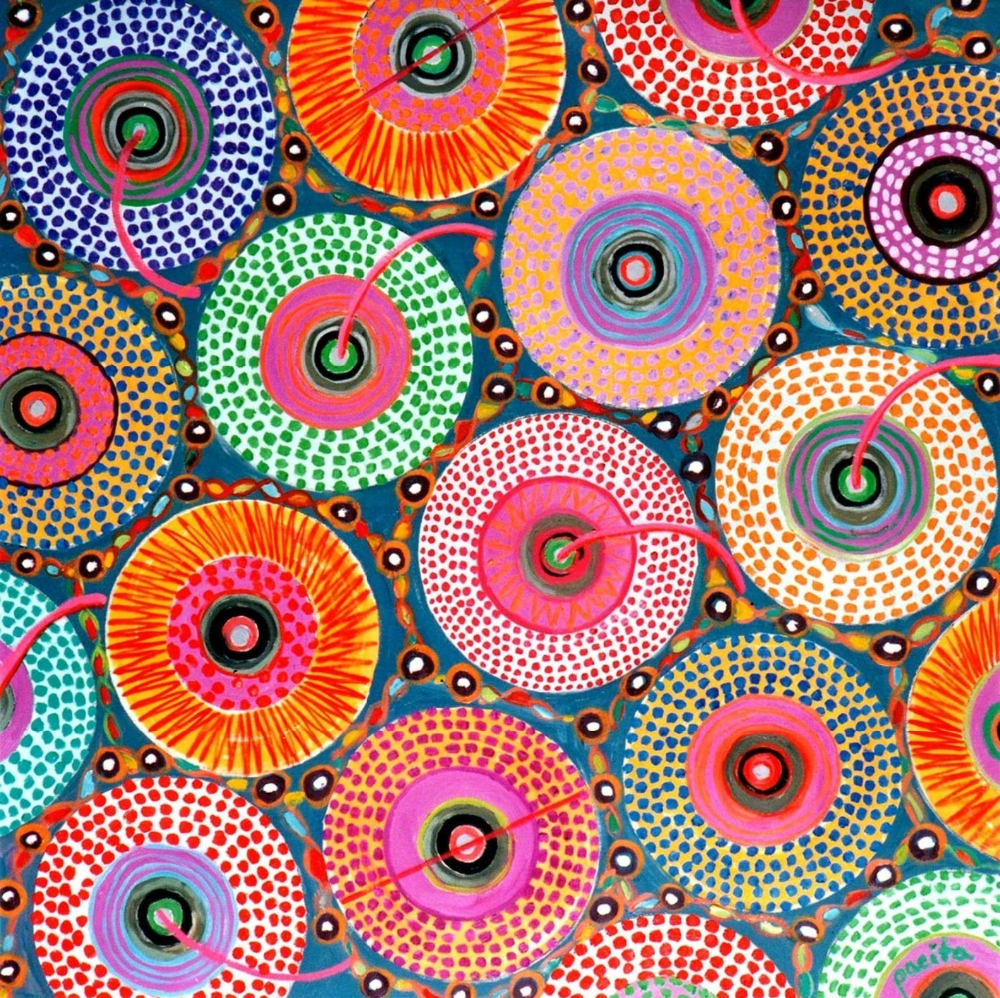

# Generative Perlin Wheel: Animated Abstract Visualization
This project is a generative art work implemented using p5.js, inspired by Yayoi Kusama's Polka Dot Art and Pacita Abad's Wheels of Fortune. The work drives multiple visual elements through Perlin noise, making them flow, breathe, and glow in the picture, creating a dynamic picture with a sense of meditation, rhythm, and depth.

## Interaction Instructions
There are **no required interactions** — just open the page and let the animation evolve:
1. Open the project in Visual Studio Code.
2. Load the `index.html` file and choose `Open with Live Server`.
3. The animation will start automatically—there is no interaction required.
4. Watch as the screen slowly transforms with organic movement driven by Perlin noise. Let it play for at least 10 seconds to observe the slow transitions and generative detail.

# Individual Approach

I focused on **Perlin noise** and **controlled randomness** as the main drivers of animation. Rather than using user interaction or music, my work explores how noise-based algorithms can simulate natural, slow-moving, organic visuals.

### Perlin Noise as Creative Driver
- Perlin noise was used to animate movement, shape modulation, and directional flow in `NoiseBlob`, `Spark`, and background elements.

- Unlike true randomness, Perlin noise produces **coherent**, **smooth variations** over time and space, which mimics natural motion like drifting clouds or flowing energy.

- Each blob's radius, position drift, and decorative dot rings are all noise-influenced, creating consistent but unpredictable evolution.

### Unique Animation Strategy

For my contribution, I focused entirely on using **Perlin noise** as the core animation driver.

**What I animated**:
- **Position**, **radius**, and **dot orbit structure** of custom elements such as `NoiseBlob`, `Radiant`, and `Hole`.
- Animated **textures**, **rotations**, and **glow behavior** using continuous noise input.

**How it's unique** from other group members:
- While others focused on user interaction (clicks, mouse drags), audio input, or shape transformations,
- My implementation emphasizes **natural, noise-driven motion**, **non-repetitive visual flow**, and **painterly procedural dots**.
- Each component (blobs, radiants, holes, sparks) uses a **different Perlin noise parameter set** for unique, layered movement.

### Animated Properties

- **Perlin noise** provides smooth randomness for motion, size, pulsation, and direction.
- **Trigonometry + time (frameCount)** drive rotating rings and dot pulsations.
- **Randomness** determines appearance variation: size, rotation, life span, and phase shifts.

All elements are **procedurally generated**—nothing is pre-designed or repeated.

## Visual Inspiration

- Yayoi Kusama’s dotted patterns 

- Pacita Abad's 'Wheels of fortune' 

These visual references inspired me to create an animation that is **meditative**, **luminous**, and **layered**.
I was particularly drawn to the repetitive dot structures and vibrant radial arrangements, which influenced the use of **Perlin-noise-driven rings**, **pulsing textures**, and **organic movement** in my generative work.

## Technical Implementation

Each of my objects (NoiseBlob, Radiant, Hole, Spark) is implemented as a **p5.js class**. Here's how noise drives them:

- **NoiseBlob**:
  - Uses `noise()` to control **position movement**, **radius oscillation**, and **rotation of concentric dot rings**.
- **Radiant**:
  - Radial beams pulse and rotate with Perlin noise, while orbiting dots distort via `noise(angle, time)`.
- **Hole**:
  - Static dark centers with procedural glow and **noisy rim dot placement**.
- **Spark**:
  - Particles wander using angle-based noise and shift color intensity with age.

### Libraries & Techniques

- **p5.js**
- `createGraphics()` for static textured backgrounds
- `globalCompositeOperation = 'lighter'` for additive blending
- `noise()` from `p5.js` for all procedural variation

## External References / Techniques

- Learned blending mode setup from:
  - [p5.js blending example](https://p5js.org/reference/#/p5/blendMode)
- Dot ring generation adapted from radial geometry concepts in:
  - The Coding Train – [Perlin Noise tutorial](https://www.youtube.com/watch?v=ikqXe3pD1dA)
- Noise-based motion from:
  - [p5.js Noise Walk Example](https://editor.p5js.org/codingtrain/sketches/FdJkDoMni)

---

## Modifications to Group Code

- I **rewrote most visual components** to use `Perlin noise` as their core behavior driver.
- Implemented **multiple new classes**, dot rendering logic, and background generation techniques.
- Extended particle systems with **glow, flicker, and orbit effects** using `frameCount` and `noise()`.